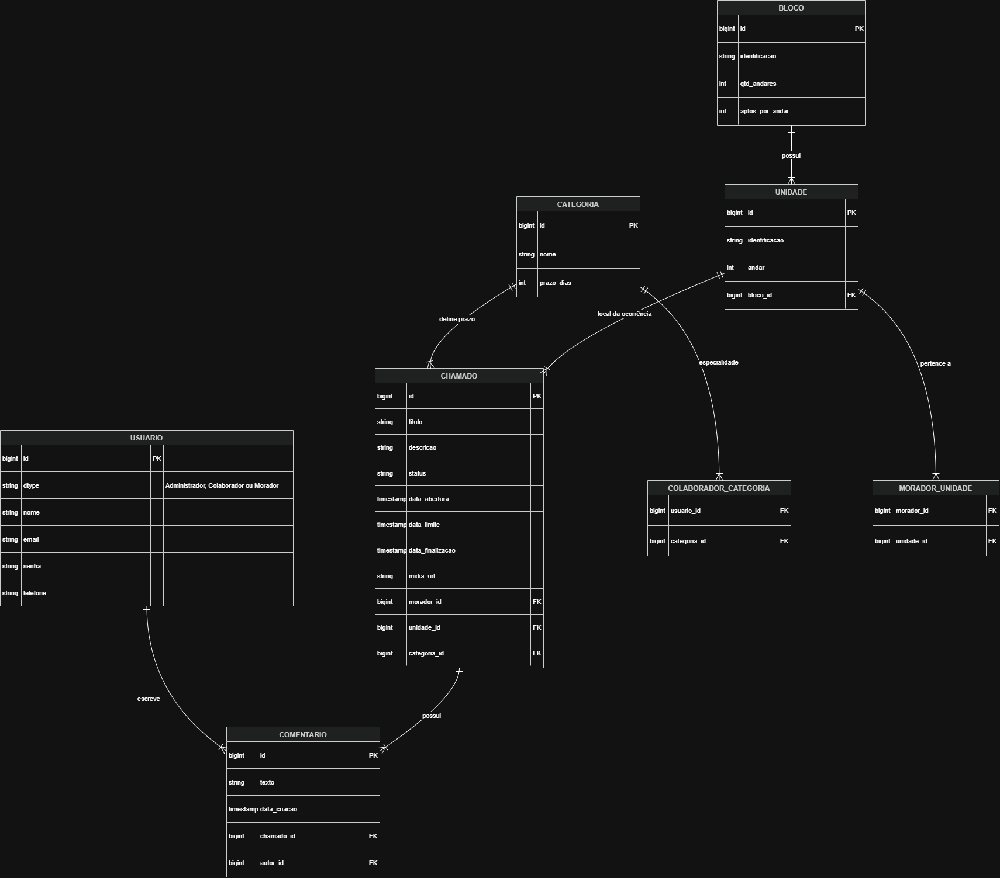
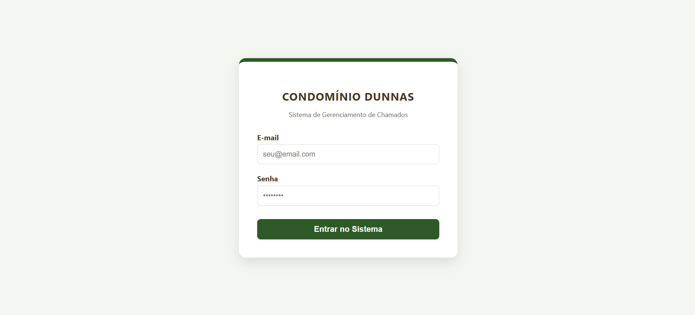
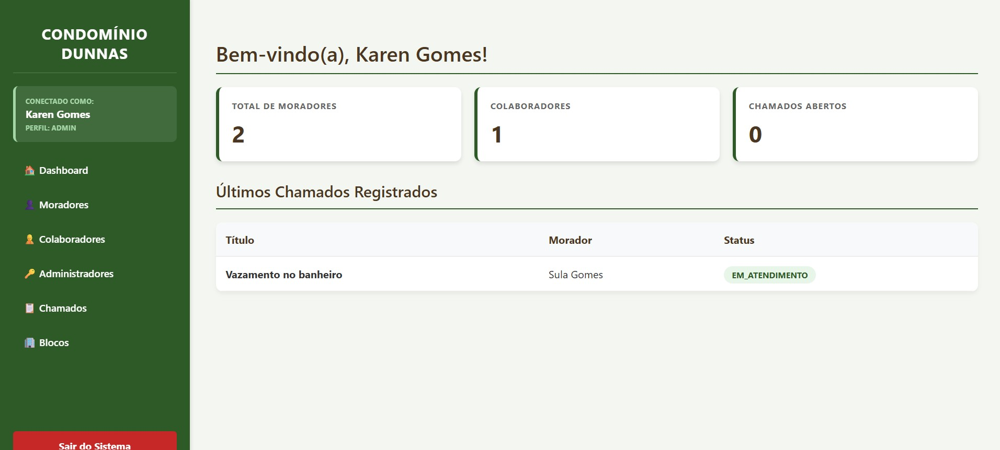
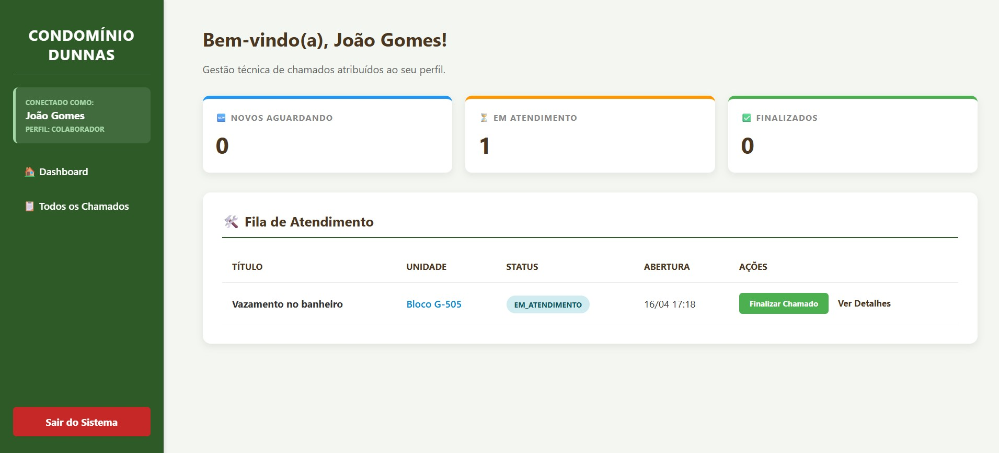
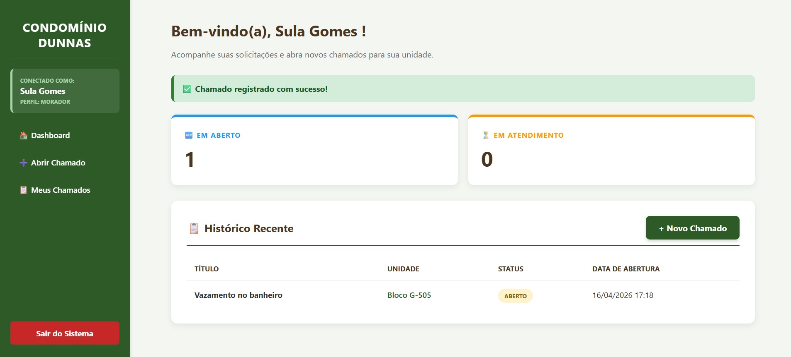
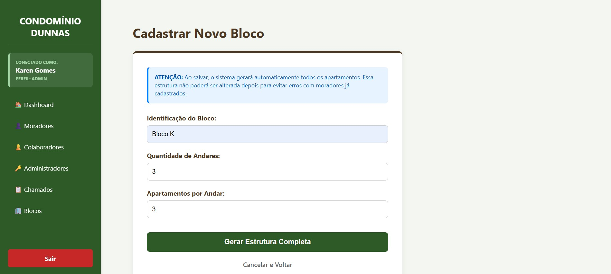
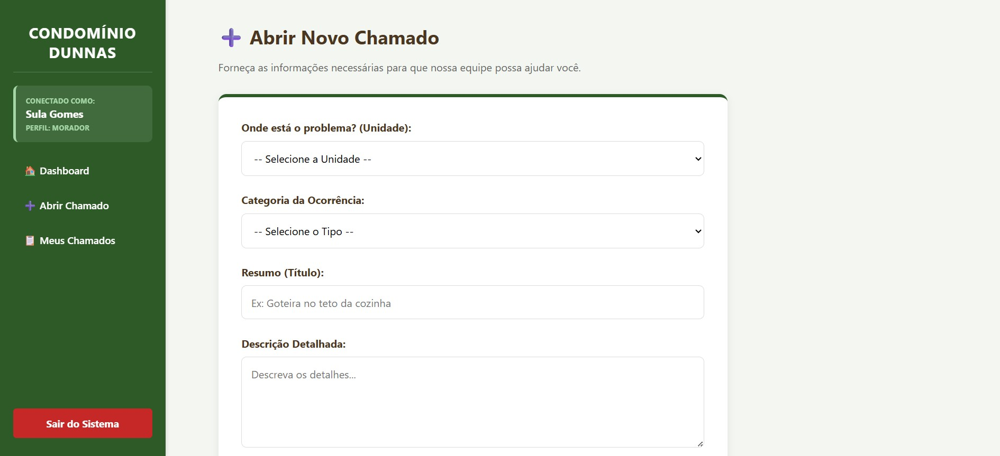
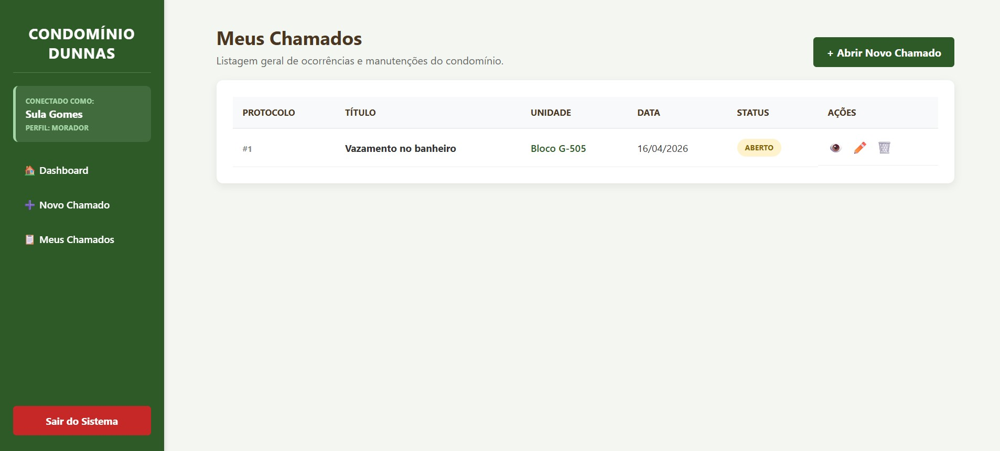
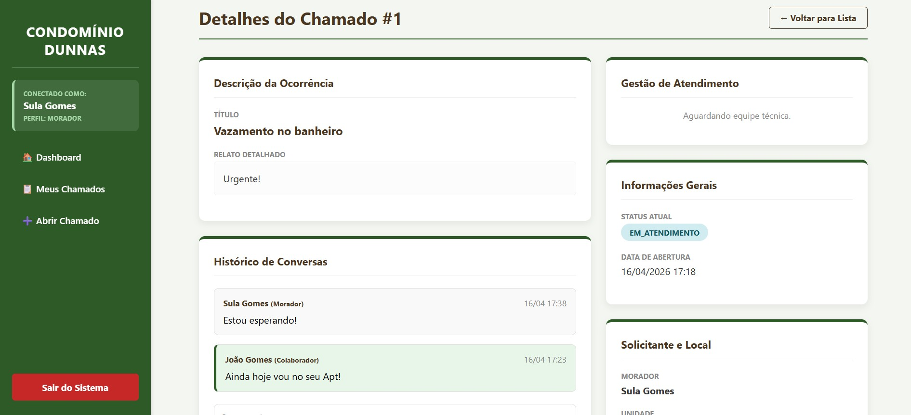

# Sistema de Gerenciamento de Chamados - Condomínio Dunnas

Este projeto consiste em um Sistema de Gerenciamento de Chamados para Condomínios, desenvolvido como parte do processo seletivo de Desenvolvimento de Software.

A aplicação permite que moradores abram chamados, enquanto colaboradores e administradores gerenciam a resolução, mantendo controle sobre a estrutura do condomínio, categorias técnicas e histórico de interações.

O sistema foi projetado com foco em:

  * Organização da infraestrutura do condomínio
  * Controle de acesso por perfil de usuário
  * Gestão de chamados com SLA
  * Histórico de comunicação
  * Integridade dos dados


## Decisões Técnicas e Estrutura

Para atender aos requisitos propostos, foi selecionada a **Opção 2** de stack tecnológica:

* **Backend:** Java com Spring Boot, utilizando o padrão MVC. 
* **Frontend:** Java Server Pages (JSP) para renderização dinâmica das interfaces
* **Banco de Dados:** PostgreSQL para persistência de dados relacionais
* **Versionamento de Banco:** Flyway, garantindo que a estrutura possa ser recriada do zero de forma consistente

---

## Gerenciamento de Perfis e Permissões

O sistema implementa um controle de acesso baseado em funções (Role-Based Access Control), onde cada perfil possui um escopo de atuação restrito, garantindo a privacidade dos moradores e a organização operacional dos técnicos.

### 1. Administrador (Gestão Estratégica)
O Administrador possui visão global do sistema e é o responsável pela configuração inicial e manutenção dos cadastros base.
* **Infraestrutura:** Responsável por cadastrar os **Blocos** e disparar a geração automática das **Unidades**.
* **Governança de Usuários:** Gerencia o ciclo de vida de todos os usuários (Admin, Colaborador e Morador). É o único perfil que pode realizar o **vínculo oficial** de um Morador a uma ou mais Unidades.
* **Configuração de Negócio:** Define as **Categorias de Chamados** e seus respectivos prazos de **SLA** (em dias).
* **Supervisão de Chamados:** Possui permissão para visualizar, comentar e alterar o status de qualquer chamado aberto no condomínio, atuando como um moderador em casos de conflito ou atraso.

### 2. Colaborador (Escopo Técnico)
O Colaborador é o perfil operacional, focado na resolução técnica das solicitações. Seu acesso é filtrado por sua especialidade.
* **Visibilidade Restrita:** Através da tabela associativa `colaborador_categoria`, o colaborador só visualiza chamados que pertencem às categorias em que ele foi previamente vinculado pelo Administrador.
* **Gestão de Fluxo:** Pode alterar o status do chamado para `EM_ATENDIMENTO` e, após a conclusão do serviço, para `CONCLUIDO` (o que dispara o registro automático da data de finalização).
* **Interação Técnica:** Utiliza o sistema de comentários para registrar o progresso do atendimento, solicitar informações adicionais ou anexar evidências da resolução.

### 3. Morador (Solicitante e Usuário Final)
O Morador é a ponta inicial do processo, focado nas demandas de sua residência.
* **Abertura de Chamados:** Pode abrir chamados vinculados exclusivamente às unidades às quais ele possui vínculo comprovado.
* **Gestão de Evidências:** No momento da abertura ou através de comentários, o morador pode realizar o **upload de anexos** (fotos ou PDFs) para detalhar o problema enfrentado.
* **Privacidade de Dados:** O sistema garante que um Morador visualize apenas o seu próprio histórico de chamados. Ele não possui acesso aos chamados de outros moradores, preservando a segurança das informações do condomínio.
* **Interação Direta:** Pode comentar nos seus próprios chamados para interagir com o técnico e acompanhar o status em tempo real.

---

### Lógica de Segurança Implementada
No backend, essa distinção é reforçada no `ChamadoService` e no `LoginController`. Quando um usuário faz login, o sistema detecta a especialização da classe (através da herança `Single Table`) e aplica os seguintes filtros:

* **Admin:** `chamadoRepository.findAll()`
* **Colaborador:** `chamadoRepository.findByCategoriaIn(colaborador.getCategoriasPermitidas())`
* **Morador:** `chamadoRepository.findByMoradorId(morador.getId())`
---

## Funcionalidades Principais

### Gestão Inteligente de Infraestrutura
O sistema automatiza a criação da malha residencial do condomínio para evitar inconsistências e facilitar a gestão administrativa.
* **Provisionamento Automatizado:** Ao cadastrar um **Bloco**, o administrador define a quantidade de andares e apartamentos por andar. O `BlocoService` processa esses dados e gera instantaneamente todas as **Unidades** vinculadas.
* **Padronização de Identificação:** As unidades são nomeadas seguindo uma lógica posicional (Ex: `Bloco + Andar + Final`).
  * *Exemplo:* No **Bloco A**, o 2º andar terá as unidades **A-201**, **A-202**, etc.
* **Vínculo Multi-Unidade:** O sistema permite que um único Morador seja vinculado a múltiplas unidades, ideal para proprietários de mais de um imóvel no mesmo condomínio.

### Ciclo de Vida do Chamado
O chamado é a entidade central do fluxo operacional, projetado para manter a rastreabilidade total da ocorrência.
* **Atributos de Auditoria:** Cada ticket armazena Título, Descrição detalhada, Categoria técnica, Unidade afetada e o Morador solicitante.
* **Gestão de Evidências:** Suporte nativo para **Upload de Anexos** (Imagens ou PDFs) com limite de 10MB, permitindo que o morador documente visualmente o problema.
* **Rastreabilidade Temporal:** Registro preciso de `Data de Abertura` e `Data de Finalização` (preenchida automaticamente ao atingir o status "Concluído").

### Mecanismo de SLA (Service Level Agreement)
O sistema garante o cumprimento dos prazos de atendimento através de um cálculo dinâmico baseado na criticidade.
* **Cálculo Automático de Deadline:** No momento da abertura, o sistema consulta o `prazo_dias` configurado na **Categoria** (ex: Elétrica - 2 dias) e define a `Data Limite`.
* **Monitoramento de Status:** O status evolui de `ABERTO` para `EM_ATENDIMENTO` e `CONCLUÍDO`, permitindo identificar rapidamente chamados que excederam o prazo estipulado.

### Histórico e Interações (Comentários)
Uma linha do tempo colaborativa centraliza a comunicação e evita a perda de informações em canais externos.
* **Segurança de Escopo em Conversas:**
  * **Moradores:** Interagem exclusivamente em seus próprios chamados.
  * **Colaboradores:** Comentam em tickets que pertencem ao seu escopo técnico de atuação.
  * **Administradores:** Possuem acesso total para mediação e supervisão.
* **Metadados do Comentário:** Cada interação registra o autor e o exato momento (Timestamp) da postagem.

### Segurança e Controle de Acesso
A proteção dos dados é garantida por múltiplas camadas de validação.
* **Herança de Dados (Single Table):** Utilização da coluna discriminadora `dtype` para separar as lógicas de Administrador, Colaborador e Morador sob uma mesma base de autenticação.
* **Gestão de Sessão HTTP:** Controle rígido de acesso via `HttpSession`, garantindo que um usuário deslogado ou sem permissão não acesse rotas internas.
* **RBAC (Role-Based Access Control):** Verificação constante do perfil do usuário em cada requisição para renderizar menus e permitir ações específicas de cada cargo.

## Estrutura de Pastas do Projeto

A organização do projeto segue as convenções do Spring Boot e o padrão arquitetural MVC (Model-View-Controller):

```text
gerenciamento-chamados/
├── assets/             # Mídias e diagramas para documentação
├── src/main/java/com/dunnas/gerenciamento_chamados/
│   ├── config/         # Configurações gerais da aplicação
│   ├── controller/     # Controladores (Gerenciamento de rotas e perfis)
│   ├── model/          # Entidades (Administrador, Colaborador, Morador, etc.)
│   ├── repository/     # Interfaces de acesso ao banco de dados (Spring Data JPA)
│   └── service/        # Regras de negócio (SLA, geração de unidades, uploads)
├── src/main/resources/
│   ├── db.migration/   # Scripts de versionamento do banco de dados (Flyway)
│   ├── static.uploads/ # Armazenamento local de anexos dos chamados
│   └── application.yaml # Configurações de banco de dados e ambiente
└── src/main/webapp/WEB-INF/jsp/
    └── # Interfaces dinâmicas do sistema (Frontend)
```

---

### Arquitetura e Versionamento de Banco de Dados

O projeto utiliza o **PostgreSQL** como motor de persistência, com a evolução do esquema gerenciada de forma automatizada pelo **Flyway**. Isso garante que o ambiente de banco de dados seja recriado de maneira idêntica em qualquer container ou máquina de desenvolvimento.

#### Ciclo de Migrações (Migrations):

* **`V1__Criação_das_tabelas_base`**: Define a estrutura central das entidades independentes.
  * Criação das tabelas `blocos`, `categorias` e a tabela unificada `usuarios`.
  * Implementação da estratégia de herança **Single Table** para os perfis de acesso.
* **`V2__Relacionamentos_e_Vínculos`**: Estabelece a malha de integridade referencial do condomínio.
  * Criação da tabela `unidades` com vínculo ao bloco.
  * Definição das tabelas associativas (`morador_unidade` e `colaborador_categoria`) para suportar relacionamentos **N:N**, permitindo que um morador possua múltiplas unidades e um colaborador atue em diversas especialidades.
* **`V3__Chamados_e_Comentários`**: Implementa a camada operacional de atendimento.
  * Estruturação da tabela `chamados` com campos de auditoria e controle de **SLA** (`data_abertura`, `data_limite`, `status`).
  * Criação da tabela `comentarios` para o histórico de interações com suporte a chaves estrangeiras para rastreabilidade de autoria.
* **`V4__Dados_de_Teste_(Seed)`**: Provisionamento de um ambiente funcional imediato.
  * Inserção de usuários padrão (Admin, Colaborador, Morador), blocos, unidades e categorias pré-configuradas para validação rápida das regras de negócio pelo avaliador.

#### Estratégias de Integridade:
* **Controle de Deleção**: Uso estratégico de `ON DELETE CASCADE` em tabelas de associação para evitar registros órfãos e garantir a consistência durante remoções de infraestrutura.
* **Unicidade**: Restrições `UNIQUE` aplicadas a e-mails de usuários e nomes de categorias para prevenir duplicidade de registros e falhas na autenticação.
* **Normalização**: Dados estruturados para evitar redundância, garantindo que o cálculo de SLA e o escopo de visibilidade sejam processados de forma eficiente via SQL.

## Modelagem de Dados (Diagrama Relacional)

A estrutura do banco de dados foi modelada para suportar a herança de usuários e os relacionamentos entre unidades e chamados.



O diagrama reflete uma arquitetura relacional projetada para garantir a integridade dos dados e o cumprimento das regras de negócio definidas no desafio:

* **Herança de Usuários (Tabela `USUARIO`)**
  Utiliza a estratégia de *Single Table Inheritance* (identificada pela coluna `dtype`), centralizando **Administradores**, **Colaboradores** e **Moradores** em uma única tabela, otimizando o controle de acesso e autenticação.

* **Hierarquia de Infraestrutura (`BLOCO` e `UNIDADE`)**
  Estabelece um relacionamento **1:N** entre **Blocos** e **Unidades**. A entidade **UNIDADE** armazena a informação do andar, permitindo a identificação única e automática do bloco, andar e apartamento.

* **Vínculos Flexíveis (Tabelas de Associação)**

* **`MORADOR_UNIDADE`**: Permite que um morador esteja vinculado a uma ou mais unidades.

* **`COLABORADOR_CATEGORIA`**: Define o escopo de atuação do colaborador, permitindo visualizar apenas os chamados relacionados às suas categorias técnicas.

* **Entidade Central (`CHAMADO`)**
  Conecta o **Morador** (solicitante), a **Unidade** (local da ocorrência) e a **Categoria** (que define o prazo de resolução/SLA).
  Também armazena os registros de tempo essenciais do sistema: data de abertura, prazo limite e data de finalização.

* **Histórico de Comunicação (`COMENTARIO`)**
  Relaciona-se com o **Chamado** e o **Usuário autor**, compondo o histórico de interações, respeitando as permissões de cada perfil.

---

### Execução via Docker e Ambiente de Desenvolvimento

A aplicação utiliza o **Docker Compose** para orquestrar o ambiente de banco de dados, garantindo que o projeto rode em qualquer máquina sem a necessidade de instalar o PostgreSQL localmente.

#### 1. Provisionamento do Banco de Dados
O arquivo `docker-compose.yml` está configurado para subir uma instância do **PostgreSQL 15**. Para iniciar, execute o comando na raiz do projeto:

```bash
docker compose up -d
```

* **O que o comando faz?** O parâmetro `-d` (detached mode) sobe o container em segundo plano. Ele baixa a imagem oficial do Postgres, cria o banco `dunnas_condominio` e configura o usuário e senha definidos.
* **Mapeamento de Porta (5433:5432):** O container roda internamente na porta padrão `5432`, mas foi mapeado para a porta **5433** do seu computador. Isso evita conflitos caso você já tenha outro PostgreSQL instalado na sua máquina.

**Detalhes da Conexão:**
* **Host:** `localhost`
* **Porta:** `5433`
* **Database:** `dunnas_condominio`
* **Usuário/Senha:** `user` / `password`

#### 2. Execução da Aplicação (Spring Boot)
Com o banco de dados ativo, a aplicação Java assume o controle para criar a estrutura de tabelas e iniciar o servidor web.

**Via Maven Wrapper:**
Se você não tem o Maven instalado globalmente, use o executável incluso no projeto:
```bash
./mvnw spring-boot:run
```

**Via Maven Global:**
```bash
mvn spring-boot:run
```

#### O que acontece na inicialização?
1.  **Conectividade:** O Spring Boot lê as propriedades no `application.yaml` e conecta-se ao container Docker na porta `5433`.
2.  **Flyway Migrations:** O sistema detecta que o banco está vazio e executa automaticamente os scripts SQL (V1 a V4), criando tabelas e inserindo os dados de teste (usuários e categorias).
3.  **Servidor Web:** O servidor Tomcat embutido é iniciado. Após a mensagem `Started GerenciamentoChamadosApplication`, o sistema estará disponível em:
  *  **URL:** `http://localhost:8080`

#### Encerrando o Ambiente
Para parar o banco de dados e remover os containers após os testes, utilize:
```bash
docker compose down
```

---

## Funcionalidades Implementadas (Checklist Técnico)

Abaixo estão listados os requisitos do edital e as funcionalidades adicionais implementadas para garantir a robustez e a usabilidade do sistema.

### Infraestrutura e Cadastros Base
* **✔ Gestão de Blocos:** Interface administrativa para cadastro de edifícios com definição de andares e apartamentos.
* **✔ Geração Automática de Unidades:** Algoritmo no `BlocoService` que provisiona instantaneamente todas as unidades de um bloco, seguindo o padrão de identificação exigido.
* **✔ Gestão de Categorias e SLA:** Cadastro de áreas técnicas com definição de prazos de resolução (SLA) em dias.
* **✔ Controle de Usuários (RBAC):** Cadastro e gestão de perfis diferenciados (Administrador, Colaborador e Morador).
* **✔ Vínculos Morador/Unidade:** Sistema de associação flexível que permite que um morador gerencie uma ou mais unidades.

### Operação de Chamados
* **✔ Fluxo de Abertura:** Interface intuitiva para moradores abrirem chamados selecionando unidade e categoria.
* **✔ Gestão de Anexos:** Sistema de upload de mídias (Fotos/PDF) integrado ao chamado e aos comentários para documentação de evidências.
* **✔ SLA Automatizado:** Cálculo em tempo real da data limite de atendimento com base na categoria técnica.
* **✔ Histórico de Interações:** Sistema de comentários por chamado, permitindo o diálogo entre morador e equipe técnica.
* **✔ Gestão de Status:** Controle do ciclo de vida do chamado: `ABERTO`, `EM ATENDIMENTO` e `CONCLUÍDO`.

### Segurança e Engenharia
* **✔ Controle de Escopo de Acesso:** Filtros de visibilidade garantindo que Colaboradores vejam apenas seu escopo técnico e Moradores apenas suas unidades.
* **✔ Autenticação e Sessão:** Gerenciamento de acesso via `HttpSession` com redirecionamento baseado no perfil logado.
* **✔ Versionamento de Banco de Dados:** Uso de **Flyway** para garantir que a estrutura (DDL) e os dados iniciais (DML) sejam replicados fielmente.
* **✔ Ambiente Containerizado:** Configuração de **Docker Compose** para orquestração imediata do banco de dados PostgreSQL.

---

### Diferenciais de Implementação

Além dos requisitos básicos, este projeto entrega:
1.  **Trava de Segurança:** Impedimento de exclusão do último administrador do sistema no `AdministradorService`.
2.  **Validação de Dados:** Uso de `jakarta.validation` para garantir que campos como e-mail, nomes e prazos de SLA sejam sempre válidos.
3.  **Clean Code:** Separação clara de responsabilidades entre Controllers, Services e Repositories, facilitando a manutenção futura.

-----

##  Como Executar o Projeto

Siga os passos abaixo para configurar o ambiente e rodar a aplicação em sua máquina local.

### 1\. Pré-requisitos

Antes de iniciar, certifique-se de ter instalado:

* **Java JDK 21** (ou superior).
* **Maven 3.8+** (opcional, se preferir usar o `mvn` global).
* **Docker e Docker Compose** (recomendado para o banco de dados).
* **PostgreSQL 15+** (caso opte por não usar o Docker).

### 2\. Configuração do Banco de Dados

#### Opção A: Via Docker (Recomendado)

Na raiz do projeto, onde reside o arquivo `docker-compose.yml`, execute:

```bash
docker compose up -d
```

*Isso subirá um container PostgreSQL na porta **5433**, já criando o banco `dunnas_condominio` automaticamente.*

#### Opção B: Instalação Manual

1.  Crie um banco de dados vazio chamado `dunnas_condominio` no seu PostgreSQL.
2.  Certifique-se de que ele esteja rodando na porta **5433** (conforme configurado no `application.yaml`) ou ajuste a URL de conexão no arquivo.

### 3\. Passos para Execução

Com o banco de dados ativo, siga as etapas:

1.  **Limpar e Compilar o projeto:**
    ```bash
    mvn clean install
    ```
2.  **Executar a aplicação:**
    ```bash
    mvn spring-boot:run
    ```

> **Nota:** Na primeira execução, o **Flyway** identificará que o banco está vazio e executará automaticamente as migrations (`V1` a `V4`), criando a estrutura de tabelas e inserindo os dados iniciais de teste.

### 4\. Acesso ao Sistema

Após a inicialização (quando o console exibir `Started GerenciamentoChamadosApplication`), acesse:

  **URL:** http://localhost:8080

-----

##  Usuários de Teste

Para facilitar a avaliação técnica das diferentes visões e escopos de acesso, utilize as credenciais abaixo (pré-configuradas via Migration SQL):

| Perfil | E-mail | Senha | Descrição do Escopo |
| :--- | :--- | :--- | :--- |
| **👑 Admin** | `admin@dunnas.com` | `123456` | Acesso total ao sistema e configurações. |
| **🛠️ Colaborador** | `colaborador@dunnas.com` | `123456` | Visualiza chamados de sua categoria técnica. |
| **🏠 Morador** | `morador@dunnas.com` | `123456` | Visualiza e abre chamados para suas unidades. |

-----

### Dicas de Navegação

1.  **Fluxo de Administrador:** Comece cadastrando um novo **Bloco** para ver a geração automática de unidades funcionando.
2.  **Fluxo de Chamados:** Faça login como **Morador**, abra um chamado anexando uma foto e depois entre como **Colaborador** para realizar o atendimento e concluir o SLA.
3.  **Logs:** O sistema está configurado para exibir o SQL formatado no console (`format_sql: true`), permitindo acompanhar as queries em tempo real.

-----

## Demonstração do Sistema

### Tela de Login



### Dashboard Administrativo



### Dashboard Colaborador


### Dashboard Morador


### Cadastro de Bloco



### Abertura de Chamado



### Lista de Chamados



### Comentários

